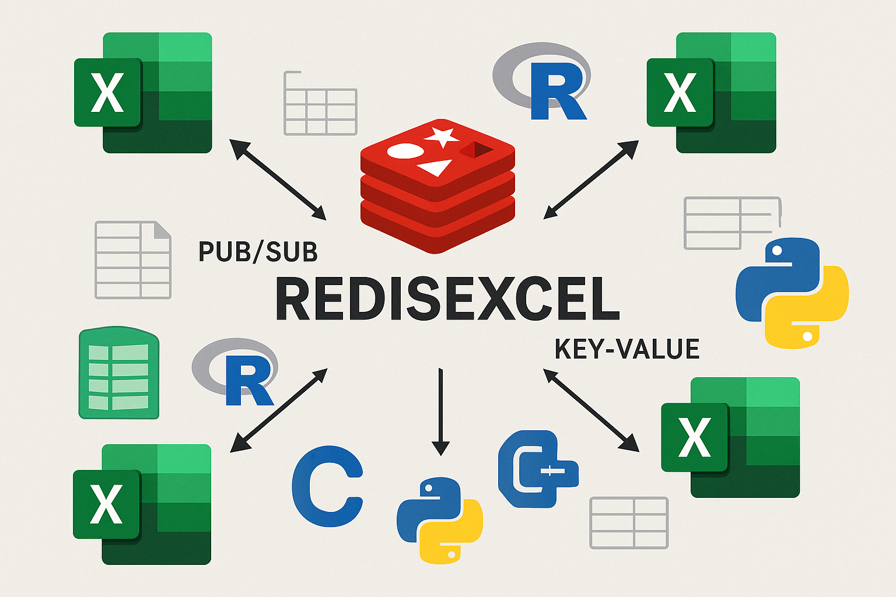

# RedisExcel



TL-DR: Read Installing in Excel and [Download Releases](https://github.com/rspadim/RedisExcel/releases)

Integration between Redis and Excel using RTD (Real-Time Data) and UDF (User Defined Functions), developed in C# (.NET Framework 4.8) with [ExcelDna](https://github.com/Excel-DNA/ExcelDna).
Supports Pub/Sub and polling with `GET`, `HGET`, `HGETALL`, `SUB`, `PSUB` commands and various UDF operations to interact with Redis.

---

## 🧹 Installing in Excel

### Quick Installation

1. Download the latest release from GitHub (`.xll`, `.dll`) - [Download Releases](https://github.com/rspadim/RedisExcel/releases)
2. Download [NLog config example files](https://github.com/rspadim/RedisExcel/blob/main/NLog.config)
3. Download [RedisExcel.json file](https://github.com/rspadim/RedisExcel/blob/main/RedisExcel.json)
4. Place (`.xll`, `.dll`, `NLog.config`) files in the **same local folder**
5. In Excel: `File > Options > Add-ins`

   * Click **Go...**, then **Browse...**, and select the `.xll` file

6. The `RedisExcel.json` file can be placed in - [Example](https://github.com/rspadim/RedisExcel/blob/main/RedisExcel.json)
>
> * The user folder (`%USERPROFILE%`) - Example: %USERPROFILE%\RedisExcel.json
> * The Excel folder
> * Or `C:\Windows\RedisExcel.json`

> **Tip:** downloaded files may be blocked by Windows (Mark of the Web) —
> right-click each file > Properties > check **Unblock** before loading the add-in.

> **Updates:** put `=RedisUDFUpdateAvailable()` in a cell to see TRUE when a
> newer release exists. Toggle the check with `"UpdateCheck": true|false` in
> `RedisExcel.json` (default on, runs in the background and never blocks Excel).

---

## 🚀 Example: Publishing from Python

```python
import redis

r = redis.StrictRedis(host='localhost', port=6379, db=0)

# Set a key
r.set("preco_btc", "67000.50")

# Publish to a channel
r.publish("canal_alerta", "ALTA")
```

---

## 🚀 Example: Publishing from Excel (send data)

```Excel
=RedisUDFSet("preco_btc", "67000.50")                          // send SET message (key-value database)
=RedisUDFSetNonVolatile("preco_btc", "67000.50")               // same as Set, but sent only once (not on every recalc)
=RedisUDFChannelPublish("canal_alerta", "ALTA")                // send PUB/SUB message
=RedisUDFChannelPublishJSON("range_of_data", A1:C20)           // send PUB/SUB Matrix, encoded as JSON
```

---

## 🚀 Example: Subscribe and UDF from Excel (fetch data)

```Excel
=RedisUDFGet("preco_btc")                                      // receive GET (key-value database) with UDF (no character limit)
=RTD("RedisRtd", , "GET", "canal_alerta")                      // receive GET (key-value database - automatic pooling) with RTD (max of 255 characters)
=RedisUDFChannelLatest("canal_alerta")                         // receive PUB/SUB with UDF (no character limit)
=RTD("RedisRtd", , "SUB", "canal_alerta")                      // receive PUB/SUB with RTD (max of 255 characters)
=RedisUDFJSONToMatrix(RedisUDFChannelLatest("range_of_data"))  // receive PUB/SUB Matrix using UDF (no RTD)
```

---

## 🛠️ Build Instructions

### Requirements

* Visual Studio 2022+
* .NET Framework 4.8
* NuGet packages:

  * ExcelDna.AddIn
  * ExcelDna.Integration
  * ExcelDna.IntelliSense
  * StackExchange.Redis
  * NLog
  * Newtonsoft.Json

### Steps

```bash
git clone https://github.com/rspadim/RedisExcel.git
```

1. Open the project in Visual Studio
2. Restore NuGet packages
3. Build in `Release` mode — the `.xll` files are generated in `bin\Release\net48\publish`

### Tests

* Unit tests (no Redis/Excel): `dotnet test test\RedisExcel.Tests\RedisExcel.Tests.csproj -c Release`
* Smoke tests (Redis only): `dotnet run --project test\SmokeTests -c Release -- "localhost:6379"`
* Excel end-to-end: `powershell -ExecutionPolicy Bypass -File test\Run-ExcelE2E.ps1`

See [AGENTS.md](AGENTS.md) and [test/README.md](test/README.md) for details,
including the Excel automation troubleshooting notes (antivirus/EDR and COM
registration).

---

## 🔎 Excel Examples

### Pub/Sub

```excel
=RTD("RedisRtd", , "SUB", "canal_alerta", "localhost:6379")
=RTD("RedisRtd", , "SUB", "canal_alerta", "dev") // can find an alias using `RedisExcel.json` file
=RTD("RedisRtd", , "SUB", "canal_alerta")  // uses default host if omitted
```

You can find other connection string formats in the [StackExchange.Redis configuration manual](https://stackexchange.github.io/StackExchange.Redis/Configuration).

---

## 📊 Available RTD Functions

| Function                    | Description                            | 
| --------------------------- | -------------------------------------- | 
| RedisRTDConnectionCount     | Number of live Redis connections (RTD only; UDF excluded) | 
| RedisRTDSubscriptionCount   | Active subscriptions (RTD only; UDF excluded) | 
| RedisRTDTopicCount          | Total number of RTD topics registered  | 
| RedisRTDChannelCount        | Distinct subscribed channels (RTD only) | 
| RedisRTDDefaultHost         | Current default Redis host             | 
| RedisRTDExcelUpdateInterval | Excel update interval (ms)             | 
| RedisRTDRedisUpdateInterval | Redis polling interval (ms)            | 
| RedisRTDRealTimeUpdates     | Is real-time update enabled? (bool)    | 
| RedisRTDMessagesCounter     | Messages received in the last full second | 

---

## RTD Parameters Reference

When calling the Excel RTD function like this:

```excel
=RTD("RedisRtd", , param1, param2, param3, param4)
```

Each parameter has a specific meaning depending on the RTD command.

### RTD Parameters Breakdown

| Param  | Description                                               |
| ------ | --------------------------------------------------------- |
| param1 | Command: GET, HGET, HGETALL, SUB, PSUB                    |
| param2 | Key, hash, or channel name                                |
| param3 | Host (optional for GET/HGETALL/SUB/PSUB), or field (HGET) |
| param4 | Host (only used in HGET if param3 is the field name)      |

> If `param3` or `param4` are omitted, the default host will be used. You can use aliases from your `RedisExcel.json`.

### Supported RTD Commands

| Command | Description                      | Arguments            |
| ------- | -------------------------------- | -------------------- |
| GET     | Polls a Redis key                | key, \[host]         |
| HGET    | Polls a field in a Redis hash    | hash, field, \[host] |
| HGETALL | Polls all fields in a Redis hash; a missing hash returns `{}` | hash, \[host]        |
| SUB     | Subscribes to a Redis channel    | channel, \[host]     |
| PSUB    | Subscribes to a Redis pattern    | pattern, \[host]     |

> All commands support specifying either a full connection string or a named host defined in the `RedisExcel.json` file.

> A `SUB`/`PSUB` topic that cannot subscribe at connect time shows `#ERROR`
> and is retried with a 1s..30s backoff, capped per tick (v1.2.7); polled
> commands (`GET`/`HGET`/`HGETALL`) retry on every tick. Editing the formula
> re-registers the topic as well.

## 💡 Available UDF Functions

Functions to use directly in Excel cells:

> **⚠️ Volatile by design:** every RedisExcel function that accesses Redis is
> volatile, so it recalculates on every edit and on `F9`. That is what keeps
> read functions fresh - and it means write functions re-execute on every
> recalculation too: `Set`, `SetJSON`, `SetKV`/`SetKVPair`, `SetEx`, `Expire`,
> `Incr`, `IncrBy`, `Rename`, `Del`, hash/list/set writers, channel publishes
> and unsubscribe all run again each time. For example, `=RedisUDFIncr("k")`
> increments the counter every time the sheet recalculates, not once. Use
> manual calculation (Formulas > Calculation Options > Manual) when that
> matters, keep write calls on a sheet you update deliberately, or use the
> non-volatile twins below. `RedisUDFChannelPublishIfChanged` guards itself: it
> only publishes when the payload changed since the last delivery. The two JSON
> conversion helpers (`RedisUDFMatrixToJSON` and `RedisUDFJSONToMatrix`) were
> already non-volatile: they are pure conversions with no `IsVolatile` flag and
> recalculate only when their inputs change.
>
> **🧊 NonVolatile write twins (24):** every write function has an additive
> `...NonVolatile` twin with the same arguments and behavior. Excel evaluates
> the twin only when the formula is entered and when one of its argument cells
> changes - `F9` and cell edits do not re-run it. `Ctrl+Alt+F9` (full
> recalculation) still re-runs it, like it does for every function. Reads stay
> volatile only (there are no read twins: `Get`, `HashGet`, `ChannelLatest`,
> ... must refresh by themselves). The 24 twins are
> `RedisUDFSetNonVolatile`, `RedisUDFSetExNonVolatile`,
> `RedisUDFDelNonVolatile`, `RedisUDFExpireNonVolatile`,
> `RedisUDFIncrNonVolatile`, `RedisUDFIncrByNonVolatile`,
> `RedisUDFRenameNonVolatile`, `RedisUDFSetJSONNonVolatile`,
> `RedisUDFSetKVNonVolatile`, `RedisUDFSetKVPairNonVolatile`,
> `RedisUDFHashSetNonVolatile`, `RedisUDFHashSetMultipleNonVolatile`,
> `RedisUDFHashDelNonVolatile`, `RedisUDFListPushRightNonVolatile`,
> `RedisUDFListPushLeftNonVolatile`, `RedisUDFListPopRightNonVolatile`,
> `RedisUDFListPopLeftNonVolatile`, `RedisUDFSetAddNonVolatile`,
> `RedisUDFSetRemoveNonVolatile`, `RedisUDFChannelPublishNonVolatile`,
> `RedisUDFChannelPublishJSONNonVolatile`,
> `RedisUDFChannelPublishIfChangedNonVolatile`,
> `RedisUDFChannelPublishIfChangedJSONNonVolatile` and
> `RedisUDFChannelUnsubscribeNonVolatile`.
> Example: `=RedisUDFSetNonVolatile("k", A1)` sends the pair when it is entered
> and again whenever `A1` changes, but not when the sheet recalculates.

| Function                         | Description                      | Parameters                                |
| -------------------------------- | -------------------------------- | ----------------------------------------- |
| RedisUDFGet                      | Get the value of a key           | key, optionalHost                         |
| RedisUDFSet                      | Set the value of a key           | key, value, optionalHost                  |
| RedisUDFSetJSON                  | Set JSON-encoded data            | key, matrix, optionalHost                 |
| RedisUDFSetKV / SetKVPair        | Set key-value pairs              | keys, values / pairs, optionalHost        |
| RedisUDFGetMultiple              | Get multiple keys                | keys\[], multipleColumnsOpt, optionalHost |
| RedisUDFType                     | Get the key type                 | key, optionalHost                         |
| RedisUDFRename                   | Rename a key                     | key, newKey, optionalHost                 |
| RedisUDFExists / ExistsMultiples | Check key existence              | key / keys\[], optionalHost               |
| RedisUDFTTL / TTLMultiples       | Time-to-live (TTL) for keys      | key / keys\[], optionalHost               |
| RedisUDFSetEx                    | Set a key with a TTL             | key, value, ttlSeconds, optionalHost      |
| RedisUDFExpire                   | Set a TTL on a key               | key, ttlSeconds, optionalHost             |
| RedisUDFDel                      | Delete a key (returns deleted count) | key, optionalHost                     |
| RedisUDFIncr / RedisUDFIncrBy    | Atomic counters                  | key, optionalHost / key, increment, optionalHost |
| RedisUDFHashSet/Get/...          | Redis Hash operations            | see combinations                          |
| RedisUDFHashDel                  | Delete a hash field              | hashKey, field, optionalHost              |
| RedisUDFListPushRight / Left     | Push to a list (returns length)  | key, value, optionalHost                  |
| RedisUDFListRange                | Get a range of list elements     | key, start, stop, optionalHost            |
| RedisUDFListPopRight / Left      | Pop a list element               | key, optionalHost                         |
| RedisUDFSetAdd                   | Add a member to a set (returns added count) | key, value, optionalHost        |
| RedisUDFSetMembers               | Get all members of a set         | key, optionalHost                         |
| RedisUDFSetRemove                | Remove a set member              | key, value, optionalHost                  |
| RedisUDFChannelPublish/...       | Pub/Sub operations               | channel, message, optionalHost            |
| RedisUDFChannelLatest            | Latest Pub/Sub message (subscribes on first use) | channel, optionalHost       |
| RedisUDFChannelUnsubscribe       | Unsubscribe a channel (host argument added in v1.2.6) | channel, optionalHost   |
| RedisUDFPubSubChannelsInfo       | Lists active Pub/Sub channels and subscriber counts | optionalHost             |
| RedisUDFUpdateAvailable       | TRUE when a newer release exists | none                                      |
| RedisUDFJSONToMatrix             | Convert JSON → Excel matrix      | json, nullValue                           |
| RedisUDFMatrixToJSON             | Convert Excel matrix → JSON      | matrix                                    |
| RedisUDFServerTime               | Redis server current time        | optionalHost                              |
| RedisUDFKeys                     | List keys by pattern (SCAN); invalid pageSize values fall back to the default | pattern, optionalHost, pageSize |
| RedisUDFConnectionCount          | Number of live UDF connections   | None                                      |
| RedisUDF...NonVolatile (24)      | Non-volatile twins of the write functions (same arguments): run on entry and when an argument cell changes, not on `F9`/edits - see the `NonVolatile` note above | same as the original function |

> **Cell values:** date/time cells are stored as their Excel serial number (use
> `TEXT()` for a date string) and boolean cells as `true`/`false` (the JSON
> path does the same).

> **Missing values:** the sentinel differs per function family. `RedisUDFGet`,
> `RedisUDFHashGet` and the list pops return an empty cell; `RedisUDFGetMultiple`
> and `RedisUDFChannelLatest` return `(null)`; RTD `GET`/`HGET` return
> `(no value)` while RTD `HGETALL` returns `{}` for a missing hash;
> `RedisUDFHashGetAll`, `RedisUDFKeys`, `RedisUDFSetMembers` and
> `RedisUDFListRange` return an empty cell when there is nothing to show;
> `RedisUDFTTL` returns `-1` and `RedisUDFExists` returns `0` for a missing key.

> **Blank keys:** `RedisUDFGetMultiple` skips blank, empty and whitespace-only
> key cells (the other multi-key functions keep one row per input).

> **ChannelLatest after unsubscribe:** `RedisUDFChannelLatest` is best-effort
> right after `RedisUDFChannelUnsubscribe` - `UNSUBSCRIBE` is fire-and-forget,
> so a rapid unsubscribe/re-subscribe can deliver an in-flight message once.

---

## 📝 Configuration Files

### Example: NLog.config

```xml
<?xml version="1.0" encoding="utf-8" ?>
<nlog xmlns="http://www.nlog-project.org/schemas/NLog.xsd"
      xmlns:xsi="http://www.w3.org/2001/XMLSchema-instance">

  <targets>
    <target name="file" xsi:type="File"
            fileName="RedisExcel.log"
            layout="${longdate}|${level:uppercase=true}|${logger}|${message} ${exception:format=toString}"
            archiveFileName="RedisExcel.${environment-user}.{#}.log"
            archiveAboveSize="104857600"
            archiveNumbering="Rolling"
            maxArchiveFiles="5"
            concurrentWrites="true"
            keepFileOpen="true"
            encoding="utf-8" />
  </targets>

  <rules>
    <logger name="*" minlevel="Debug" writeTo="file" />
  </rules>
</nlog>
```

### JSON Configuration (RedisExcel.json)

```json
{
  "RTD": {
    "host": "localhost:6379",
    "timeout": 1000,
    "RedisUpdateRateMs": 1000,
    "ExcelUpdateRateMs": 100,
    "MessageCounterThreshold": 1000,
    "ExcelUpdateStyle": "Automatic",
    "UseGetMultiple": true
  },
  "UDF": {
    "host": "localhost:6379",
    "timeout": 1000
  },
  "Servers": {
    "prod": "localhost:6379,defaultDatabase=0",
    "dev": "localhost:6379,defaultDatabase=1"
  },
  "UpdateCheck": true,
  "SkipRepeatedMessages": true,
  "CoalesceRealtimeUpdates": true,
  "PublishDedupCacheSize": 10000,
  "SyncWrite": "fireforget",
  "AsyncWrites": false
}
```

> **Config notes:** the file is read once per Excel process - restart Excel
> after editing it. The first existing file wins (user profile, Excel folder,
> `C:\Windows`); if that file is malformed, safe defaults are used instead of
> falling through to a lower-priority file. `PublishDedupCacheSize`
> (default `10000`) caps the LRU cache used by
> `RedisUDFChannelPublishIfChanged` to remember the last payload published per
> host/channel.

### Write Behavior (`SyncWrite` / `AsyncWrites`)

These keys control how UDF writes reach Redis; the `...NonVolatile` twins use
the same write path. Like the rest of the file they are read once per Excel
process. `SyncWrite` is case-insensitive; unknown or blank values fall back to
`fireforget`.

| Key | Default | Values | Effect |
| --- | ------- | ------ | ------ |
| `SyncWrite` | `"fireforget"` | `"sync"`, `"fireforget"`, `"fireforget-all"` | How a write waits for the Redis reply (modes below). |
| `AsyncWrites` | `false` | `true` / `false` | Where a write runs: on the Excel calculation thread (`false`) or on a per-host serial worker (`true`). |

`SyncWrite` modes:

- `"sync"` - every write blocks until Redis replies and the cell shows the real
  result or error (the pre-v1.3.0 behavior).
- `"fireforget"` (default) - result-agnostic writes (`Set`, `SetJSON`,
  `SetKV`/`SetKVPair`, `SetEx`, `Rename`, `HashSet`, `HashSetMultiple`, list
  pushes and channel publishes) are sent with FireAndForget and return the
  marker `OK FireForget`; reply-dependent writes (`Del`, `Incr`, `IncrBy`,
  `Expire`, `SetAdd`, `SetRemove`, `HashDel` and the list pops) still block and
  return their real result. `RedisUDFChannelUnsubscribe` never uses the
  fire-and-forget path: it removes the local listeners deterministically and
  returns its own result.
- `"fireforget-all"` - every write uses FireAndForget (except
  `RedisUDFChannelUnsubscribe`, which always completes its listener
  bookkeeping): result-agnostic writes return `OK FireForget`, reply-dependent
  writes return `OK-FireForgetAll`.

In the fire-and-forget modes an error detected after the command is dispatched
(or a delivery failure) is only logged - the cell keeps the marker - while
validation and host/config failures before the dispatch still surface as
`Error:`. A publish returns the marker instead of `N readers(s)`
(`RedisUDFChannelPublishIfChanged` reports `No change` when the payload was
suppressed; in the fire-and-forget modes its dedup marker is recorded without
a confirmed delivery, so an external subscriber joining later may miss an
unchanged payload until it changes). The markers mean the write was sent, not
confirmed by Redis.

`AsyncWrites: true` dispatches writes through Excel-DNA's async support
instead of the Excel calculation thread: the cell first shows Excel's pending
marker (`#N/A`) and then updates to the real value/error (or the
fire-and-forget marker). Each formula writes exactly once - the recalculation
that delivers the result returns the cached value (the call identity is the
cell plus the resolved host plus the formula's arguments) instead of
re-running the write. A write whose host cannot be resolved falls back to the
synchronous path (no pending marker); a write with no worksheet caller (e.g.
invoked from a macro) is refused with an `Error:` cell, and repeated
evaluations with unchanged arguments keep the cached value. Same-host writes are
serialized by a per-host FIFO queue (other hosts are not blocked); the order is
the dispatch order. `SyncWrite` still decides whether that write waits for the
reply - so `"sync"` + `AsyncWrites: true` returns real results and errors
without blocking Excel.

---

## ♻️ Force Update in Excel

* Press `F9` (this re-runs the volatile functions; the `...NonVolatile` twins
  only re-run on a full recalculation, `Ctrl+Alt+F9`)
* Or use VBA:

```vba
Dim nextUpdate As Date

Sub RefreshRTD()
    Sheet1.Calculate
    nextUpdate = Now + TimeValue("00:00:01")
    Application.OnTime nextUpdate, "RefreshRTD"
End Sub

Sub StopUpdate()
    On Error Resume Next
    Application.OnTime nextUpdate, "RefreshRTD", , False
End Sub
```

---

## 📬 Contact

Open an *issue* on GitHub or email as instructed in the repository.
